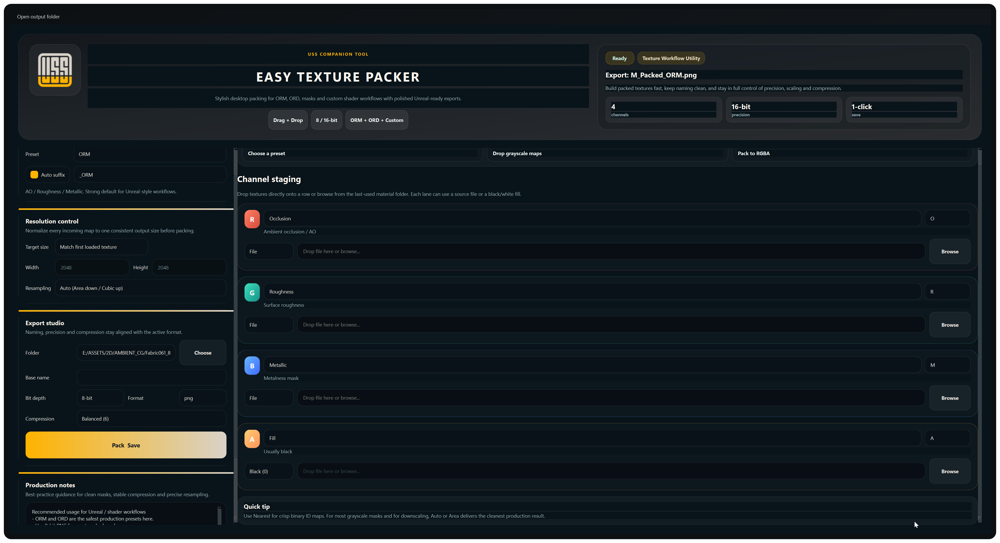

# USS Texture Packer

USS Texture Packer is a lightweight desktop companion utility for packing linear grayscale maps into practical RGBA texture outputs for Unreal Engine material workflows.

It is intended for fast channel packing tasks such as:
- ORM
- ORD
- MRD
- RMA
- MRA
- ARM
- generic packed mask outputs

The tool is optional and works well alongside Ultra Surface Shader, but it is not limited to USS-specific materials.

## What It Does

- combines separate linear grayscale source maps into a single packed RGBA output
- supports common Unreal workflow targets and custom channel layouts
- keeps texture preparation faster and more consistent for shader and material work

## Current Release

The current public build is distributed through the GitHub Releases tab:

- `USS_TEXTURE_PACKER_v1_0_0.zip`

## Included Presets

- `ORM`
- `ORD`
- `MRD`
- `RMA`
- `MRA`
- `ARM`
- `Masks`
- `Custom`

## Screenshot

## Notes

- This is a standalone Windows executable.
- The tool is provided as a free companion utility.
- Ultra Surface Shader itself remains the main product.
- Machine-specific publish notes are intentionally kept out of the public repository.
